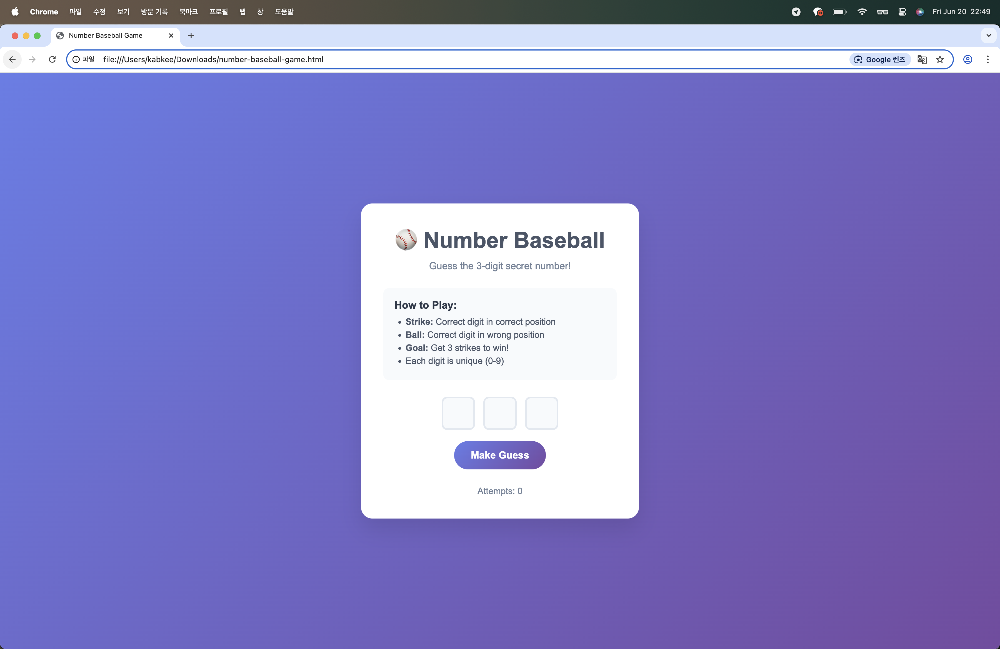
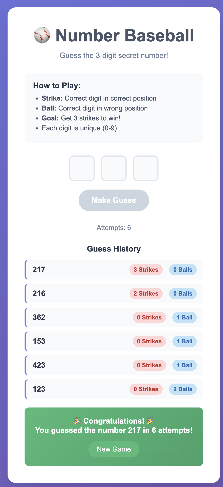

# 🎮 Number Baseball Game (HTML5 + CSS)

This is a lightweight **3-digit Number Baseball Game** built using **only HTML5 and CSS**, generated using **Amazon Q CLI** for the [AWS Game Challenge Event](https://community.aws/content/2xIoduO0xhkhUApQpVUIqBFGmAc/build-games-with-amazon-q-cli-and-score-a-t-shirt).

## 🧠 My Prompt to Amazon Q CLI

> **Prompt:**  
> _Make a number-baseball game in HTML5 and CSS only, in the folder of `/Users/kabkee/Downloads`._

Amazon Q CLI interpreted the prompt and generated a fully functional number baseball game in a single `.html` file.

---

## 🚀 Features

- 🎨 Clean, responsive design with modern styling
- 🔢 3-digit number input with auto-focus navigation
- ✅ Real-time validation (unique digits only)
- 🧠 Strike & Ball feedback after each guess
- 🧾 Guess history display
- 🎉 Win detection + celebration message
- 📱 Mobile-friendly layout
- 💫 Smooth animations and hover effects

## 🎯 Game Rules

1. The computer generates a random 3-digit number (all digits are unique).
2. You guess the number using three separate input fields.
3. After each guess, you'll get:
   - **Strikes**: correct digit in the correct position.
   - **Balls**: correct digit but in the wrong position.
4. Get **3 strikes** to win!

## 🧩 Mechanics

- All digits must be **unique** (0–9)
- Attempts are counted and displayed
- Guess history is retained
- You can **restart** anytime

> ℹ️ The secret number is logged to the browser console for testing purposes — you can remove that line for actual gameplay.

## 🕹️ How to Play

Just open the file:

