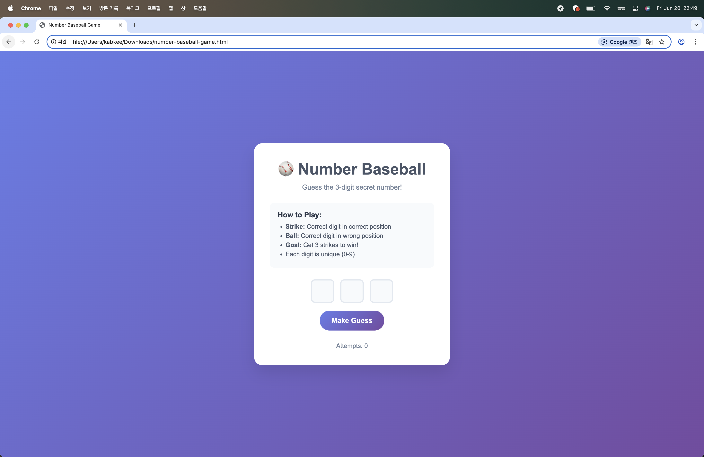

# ⚾️ Number Baseball Game with Amazon Q CLI

A clean, responsive Number Baseball game created using **HTML5 and CSS only**—built with the help of **Amazon Q CLI**.  
Participating in the [Build Games with Amazon Q CLI Challenge](https://community.aws/content/2xIoduO0xhkhUApQpVUIqBFGmAc/build-games-with-amazon-q-cli-and-score-a-t-shirt).

## 🧠 My Prompt to Amazon Q CLI

> **First Prompt:**  
> `Make a number baseball game using HTML5 and CSS only, in the folder /Users/kabkee/Downloads.`  

## ✨ Features

- Clean, responsive design with a modern gradient background
- 3-digit input fields with automatic focus navigation
- Real-time validation (unique digits only)
- Guess history with strikes and balls display
- Win detection with celebration message
- Mobile-friendly responsive design
- Smooth animations and hover effects

### 🔧 Game Mechanics

- All digits must be unique (0–9)
- Automatic input validation
- Tracks number of attempts
- Shows complete guess history
- Option to start a new game after winning
- The secret number is logged in the developer console for testing

## 🧠 My Prompt to Amazon Q CLI (continued)

> **Second Prompt:**  
> `That’s a great result, and I like the design as well. I’d like to add a feature that allows the user to switch the digit count from 3 to 4. The 3-digit baseball game is the original one, but it’s somehow quite easy.`

## 🆙 Enhanced Features – Difficulty Selection

- **Difficulty Selector**: Radio buttons to choose between 3-digit (Easy) and 4-digit (Hard) modes
- **Dynamic Input Fields**: Automatically adjusts based on difficulty
- **Smart UI Updates**: Rules and labels change dynamically
- **Enhanced Win Message**: Displays difficulty level
- **Seamless Switching**: Changing difficulty resets the game

### 🧠 Difficulty System

- **3 Digits (Easy)**: Traditional mode (720 combinations)
- **4 Digits (Hard)**: Challenging mode (5040 combinations)

> **Third Prompt:**  
> `All works perfectly. As the game gets harder to play, the guess history keeps getting longer downward, so I cannot see the whole page at once. Split the screen into two areas — left for the game layout and right for the guess history.`

## 🖥️ Major Layout Redesign – Split Screen

To improve usability, especially for longer games:

- **Split-Screen Layout**
  - **Left Panel**: Game controls, difficulty, inputs
  - **Right Panel**: Guess history (scrollable)
- **Improved UX**
  - Game panel stays visible at all times
  - History panel scrolls independently
  - Empty state with a target icon before first guess
- **Responsive Design**
  - Stacks vertically on small screens
  - Adjusted max-height to prevent overflow
  - Smooth scroll and custom scrollbar style

## 🚀 How to Play

1. A secret number (3 or 4 digits, all unique) is generated.
2. Enter your guess using the input fields.
3. Receive feedback:  
   - **Strike**: correct digit, correct position  
   - **Ball**: correct digit, wrong position
4. Win by getting full strikes!

## 📸 Screenshot

## 🕹️ How to Run

Simply open the file in your browser:
/index.html